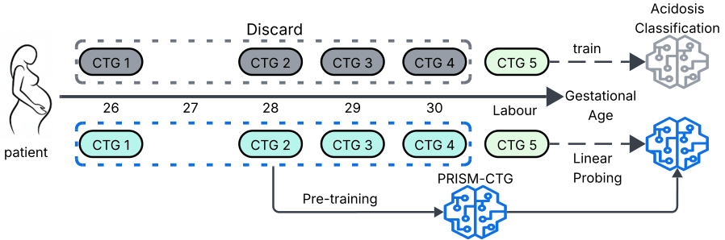

# PRISM-CTG
<p align="center">
  
</p>

Traditional deep learning models for CTG analysis are often trained on limited patient cohorts or narrowly curated datasets, which constraints their potential performance. In this study, we introduce the first Foundation Model: PRISM-CTG, pre-trained with a multi-view self-supervised learning framework, specifically designed for CTG domain that incorporates clinical and patient context during pretraining. PRISM-CTG achieved SOTA performance against current SSL and in-domain model architectures across all 7 CTG tasks. We also conducted external validation on datasets from 2 institutions, to mirror real-world deployment without additional fine-tuning, and showed that large-scale in-context pretraining enable better performance. The link to the model's weights will be added soon!   

- Wong, S., Shankar, R., Albert, B., Fei, H., Li, L., M'Barek, I.B., Vatish, M. and Jones, G.D., 2026. PRISM-CTG: A Foundation Model for Cardiotocography Analysis with Multi-View SSL. arXiv preprint arXiv:2605.02917.

## News
* The paper was accepted at ECML! 💥💥💥

## 📝Overview
This repositary provide the code for pretraining PRISM-CTG with multi-view self-supervised learning framework. There are currently no large-scale CTG datasets publicly available due to ethical and privacy constraints. Researchers may use the CTU-UHB dataset for experimentation and pipeline validation. However, for meaningful domain representation, the model should be trained on large-scale CTG data. Please replace the dataset with your institution’s data for full-scale pretraining. 

## 🤝PRISM-CTG learns meaningful CTG representation
2D-PCA visualisation on Task 4 showed meaningful representation based on the encoder representation alone, without additional linear-probing on the downstream dataset. 

<p align="center">
  
</p>

## 👨‍💻Usage
PRISM-CTG can be trained on either intrapartum or anteparum CTG, as long as the majority of the patient metadata is available. PRISM-CTG expect the CTG data to be 1Hz in 20 minutes chunks, and your data to have the following input: 
### Pre-training Input

A single `.npz` file containing:

| Key              | Shape        | Description              |
|------------------|--------------|--------------------------|
| `fhr_segments`   | `[N, 1200]`  | Fetal heart rate signal  |
| `toco_segments`  | `[N, 1200]`  | Tocodynamometer signal   |
| `gest_age`       | `[N]`         | Gestational age          |
| `maternal_age`   | `[N]`         | Maternal age             |
| `time_to_birth`  | `[N]`         | Time to birth            |

### Linear Probing Input

A directory containing:

| File            | Shape           | Description                                           |
|-----------------|-----------------|-------------------------------------------------------|
| `X_train.npy`   | `[N, 2, 1200]`  | Training signals (channel 0 = FHR, channel 1 = TOCO) |
| `y_train.npy`   | `[N]`            | Training labels                                      |
| `X_test.npy`    | `[N, 2, 1200]`  | Test signals                                         |
| `y_test.npy`    | `[N]`            | Test labels                                          |

### Pre-training
```
python run_pretraining.py --data_path /YOUR_CTG_DATA/CTG.npz 
```

### Linear-probing

We use CLS token as default:
```
python run_linear_probe.py --checkpoint /YOUR_MODEL/MODEL.pt --data_dir /YOUR_CTG_DATA/CTG_DIRECTORY
```

Alternatively, you could use patches for linear-probing:
```
python run_linear_probe.py --checkpoint /YOUR_MODEL/MODEL.pt --data_dir /YOUR_CTG_DATA/CTG_DIRECTORY --pooling patches_mean
```
### CTG Examples
Researchers could access `Example_data/` for CTG examples.

## 🏨Dataset
### 🎯Pretraining
**Oxford Maternal Databasse (OXMAT)**: Unavailable due to privacy and ethical reason. Individual requests for access may be considered on a case-by-case basis, subject to institutional approval. Please contact [REDACTED].

**SPAM**: https://users.ox.ac.uk/~ndog0178/CTGchallenge2017.html

### 🔧Evaluation Dataset
**Oxmat-2025**: Unavailable due to privacy and ethical reason. Individual requests for access may be considered on a case-by-case basis, subject to institutional approval. Please contact [REDACTED].

**CTU-UHB**: https://archive.physionet.org/pn3/ctu-uhb-ctgdb/HEADER.shtml

**APHP-CTG**: The APHP-CTG dataset is expected to be made publicly available in 2026, subject to final administrative approval. A link to the official database will be added upon release.

## 📋Notes
🔥The original research code has been cleaned and simplified to improve readability and reduce implementation complexity. The complete version of the research code can be made available upon request.

🔥We are constantly updating this repository and would be happy to receive and incorporate any feedback. Please do not hesitate to contact us.

🔥We also encourage researchers with CTG datasets not currently included here to reach out so we can support further evaluation and also, if necessary, pretraining.
## License
MIT License

Copyright (c) 2024 Auton Lab, Carnegie Mellon University

Permission is hereby granted, free of charge, to any person obtaining a copy of this software and associated documentation files (the "Software"), to deal in the Software without restriction, including without limitation the rights to use, copy, modify, merge, publish, distribute, sublicense, and/or sell copies of the Software, and to permit persons to whom the Software is furnished to do so, subject to the following conditions:

The above copyright notice and this permission notice shall be included in all copies or substantial portions of the Software.

THE SOFTWARE IS PROVIDED "AS IS", WITHOUT WARRANTY OF ANY KIND, EXPRESS OR IMPLIED, INCLUDING BUT NOT LIMITED TO THE WARRANTIES OF MERCHANTABILITY, FITNESS FOR A PARTICULAR PURPOSE AND NONINFRINGEMENT. IN NO EVENT SHALL THE AUTHORS OR COPYRIGHT HOLDERS BE LIABLE FOR ANY CLAIM, DAMAGES OR OTHER LIABILITY, WHETHER IN AN ACTION OF CONTRACT, TORT OR OTHERWISE, ARISING FROM, OUT OF OR IN CONNECTION WITH THE SOFTWARE OR THE USE OR OTHER DEALINGS IN THE SOFTWARE.

See [MIT LICENSE](https://github.com/mononitogoswami/labelerrors/blob/main/LICENSE) for details.
