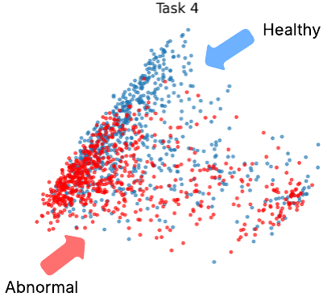

# PRISM-CTG
Traditional deep learning models for CTG analysis are often trained on limited patient cohorts or narrowly curated datasets, which constraints their potential performance. In this study, we introduce the first Foundation Model: PRISM-CTG, pre-trained with a multi-view self-supervised learning framework, specifically designed for CTG domain that incorporates clinical and patient context during pretraining. 

## Overview
This repositary provide the code for pretraining PRISM-CTG with multi-view self-supervised learning framework. We use CTU-UHB as pretraining example. Please replace the data with your institutions' data for pretraining. 

## PRISM-CTG learns meaningful CTG representation
2D-PCA visualisation on Task 4 showed meaningful representation based on the encoder representation alone, without additional linear-probing on the downstream dataset. 

<p align="center">
  
</p>

## Usage
### Pre-training
```
python run_pretraining.py --data_path /path/to/your/data.npz 
```

### Linear-probing
```
python run_linear_probing.py 
```

## Dataset
### Pretraining
**Oxford Maternal Databasse (Oxmat)**: Unavailable due to privacy and ethical reason. Individual requests for access may be considered on a case-by-case basis, subject to institutional approval. Please contact gabriel.jones@wrh.ox.ac.uk.

**SPAM**: https://users.ox.ac.uk/~ndog0178/CTGchallenge2017.html

### Evaluation Dataset
**Oxmat-2025**: Unavailable due to privacy and ethical reason. Individual requests for access may be considered on a case-by-case basis, subject to institutional approval. Please contact gabriel.jones@wrh.ox.ac.uk.

**CTU-UHB**: https://archive.physionet.org/pn3/ctu-uhb-ctgdb/HEADER.shtml

**Assistance Publique Hôpitaux de Paris (APHP)**: The APHP dataset is expected to be made publicly available in 2026, subject to final administrative approval. A link to the official database will be added upon release.
